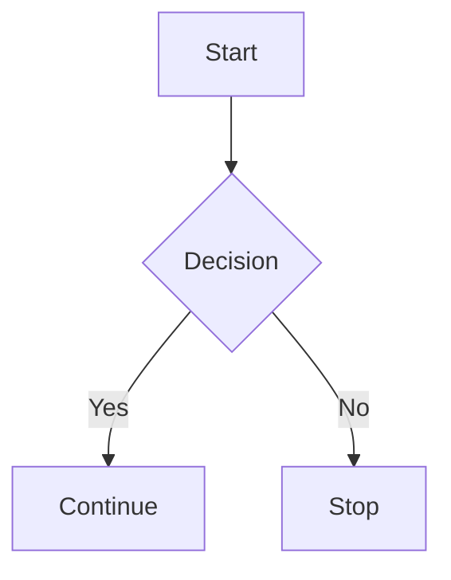

# Heading 1
## Heading 2
### Heading 3
#### Heading 4
##### Heading 5
###### Heading 6

---

## Text Formatting

**Bold Text**

*Italic Text*

***Bold and Italic***

~~Strikethrough~~

`Inline Code`

<u>Underline (HTML)</u>

> Blockquote
>
> Multi-line blockquote.

>> Nested Blockquote

---

## Lists

### Unordered List

- Item 1
- Item 2
  - Nested Item
    - Deep Nested Item
- Item 3

### Ordered List

1. First
2. Second
3. Third
   1. Nested First
   2. Nested Second

### Task List

- [x] Completed Task
- [ ] Pending Task

---

## Links

[Google](https://www.google.com)

<https://www.google.com>

---

## Images


---

## Code Blocks

### Python

```python
def hello():
    print("Hello World")

hello()
```

### Bash

```bash
echo "Hello World"
ls -la
```

### JSON

```json
{
  "name": "Viz",
  "language": "Python"
}
```

---

## Tables

| Name | Age | Role |
|------|-----|------|
| Viz  | 19  | Student |
| Alex | 22  | Developer |

### Alignment

| Left | Center | Right |
|:-----|:------:|------:|
| A | B | C |
| 1 | 2 | 3 |

---

## Horizontal Rule

---

***

___

---

## Escaping Characters

\*Not Italic\*

\# Not a Heading

\`Not Code\`

---

## Footnotes

Here's a sentence with a footnote.[^1]

[^1]: This is the footnote.

---

## Definition List (Some Markdown Flavors)

Term 1
: Definition 1

Term 2
: Definition 2

---

## Emoji

:smile:
:rocket:
:heart:

---

## Mathematical Expressions

Inline:

$E = mc^2$

Block:

$$
\int_a^b f(x)\,dx
$$

---

## HTML Support

<div align="center">
  <h3>Centered HTML Content</h3>
</div>

<details>
  <summary>Click to Expand</summary>

Hidden content here.

</details>

---

## Keyboard Keys

<kbd>Ctrl</kbd> + <kbd>C</kbd>

<kbd>Ctrl</kbd> + <kbd>V</kbd>

---

## Highlight (Some Flavors)

==Highlighted Text==

---

## Subscript / Superscript

H~2~O

X^2^

---

## Nested Example

1. Main Item
   - Sub Item
     > Blockquote inside list
     
     ```python
     print("Code inside list")
     ```

---

## Mermaid Diagram (Supported Platforms)



---

## YAML Front Matter

```yaml
---
title: Markdown Demo
author: Viz
date: 2026-06-19
---
```

---

## Mixed Formatting

> **Important:** Read the `documentation` before running:
>
> ```bash
> rm -rf /
> ```
>
> Visit [Docs](https://example.com)

---

End of Markdown Demo.
